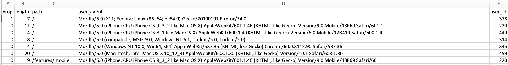

## Name

WEB Traffic Transfer

## Objective

This Python script is designed to retrieve data from a web service that provides files organized by alphabetical order. The script concatenates these files into a single Pandas DataFrame and performs a pivot operation on the data. The resulting pivoted DataFrame is then saved as a CSV file.

## Source Data
The data set consists of 26 CSV files in an AWS S3 bucket. The files are named with lowercase
ascii letters (a.csv, b.csv. c.csv, … z.csv). 

They can be accessed from the public root URL:
https://public.wiwdata.com/engineering-challenge/data/

1. a.csv: https://public.wiwdata.com/engineering-challenge/data/a.csv
2. b.csv: https://public.wiwdata.com/engineering-challenge/data/b.csv
and so on. 

Each CSV file has a header row labeling the included columns, which are:

1. drop: Whether or not this was the last page the user visited before leaving the site.
2. length: How long the user spent on the page in seconds.
3. path: The page within the website that the user visited.
4. user_agent: The browser identifier of the user visiting the page.
5. user_id: The unique identifier for the user visiting the page.



## Usage

1. Clone the repository:

```python
git clone https://github.com/yourusername/wiw_web_traffic_aashka.git
cd web-traffic-transfer
```

2. Run the script:

```python
python wiw_web_traffic_aashka.py
```

## Dependencies

1. Python 3.x
2. Pandas library (install via [pip](https://pip.pypa.io/en/stable/) install pandas)


```bash
pip install pandas
```


## Configuration

1. Modify the root_url variable in the script to point to the desired data source:

```python
# Inside wiw_web_traffic_aashka.py
root_url = "https://public.wiwdata.com/engineering-challenge/data/"
```
## File Structure
**wiw_web_traffic_aashka.py:** The main Python script.

## Explanation
The script follows these main steps:

1. **Alphabet List Generation:** Creates a list of all lowercase letters from 'a' to 'z' to handle files organized alphabetically.

2. **DataFrame Concatenation:** Iterates through each letter in the alphabet, appends it to the root_url, and downloads the corresponding CSV file. Each file is then read into a Pandas DataFrame, and all DataFrames are concatenated into a single combined_df.

3. **Pivot Operation:** Applies a pivot table operation on the combined DataFrame (combined_df) using 'user_id' as the index, 'path' as columns, and 'length' as values. Missing values are filled with 0 using fillna(0).

4. **Output:** The processed data is saved in a CSV file named 'wiw_final_traffic.csv' in the same directory as the script. You can open this CSV file in Excel or any other data analysis tool for further review.

## Authors

Aashka Agarwal
